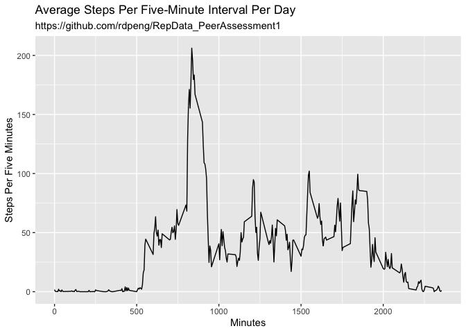
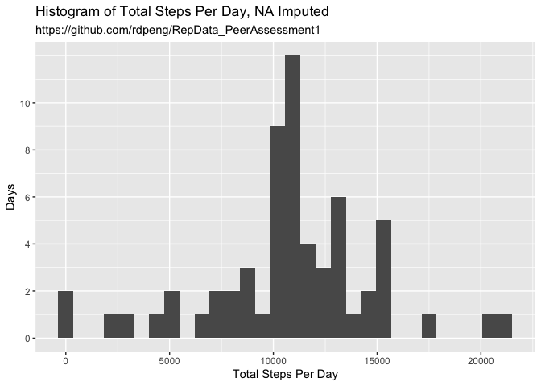

## Loading and preprocessing the data

```r
library(tidyverse)
```

```
## ── Attaching packages ─────────────────────────────────────── tidyverse 1.3.0 ──
```

```
## ✓ ggplot2 3.3.3     ✓ purrr   0.3.4
## ✓ tibble  3.0.4     ✓ dplyr   1.0.2
## ✓ tidyr   1.1.2     ✓ stringr 1.4.0
## ✓ readr   1.4.0     ✓ forcats 0.5.0
```

```
## ── Conflicts ────────────────────────────────────────── tidyverse_conflicts() ──
## x dplyr::filter() masks stats::filter()
## x dplyr::lag()    masks stats::lag()
```

```r
unzip("activity.zip")
active <- read.csv("activity.csv")
active$date <- as.Date(active$date, format = "%Y-%m-%d")
```
## What is mean total number of steps taken per day?

```r
steps <- active %>%
        group_by(date) %>%
        summarize(mean_steps = mean(steps, na.rm = TRUE), 
                  total_steps = sum(steps, na.rm = TRUE),
                  median_steps = median(steps, na.rm = TRUE))
```

```
## `summarise()` ungrouping output (override with `.groups` argument)
```

```r
mean(steps$total_steps, na.rm = TRUE)
```

```
## [1] 9354.23
```
## What is the average daily activity pattern?

```r
intervals <- active %>%
        group_by(interval) %>%
        summarize(mean_steps = mean(steps, na.rm = TRUE))
```

```
## `summarise()` ungrouping output (override with `.groups` argument)
```

```r
plot_intervals <- ggplot(intervals, aes(interval, mean_steps))
plot_intervals + geom_line() + 
        labs(title = "Average Steps Per Five-Minute Interval Per Day",
             subtitle = "https://github.com/rdpeng/RepData_PeerAssessment1",
             x = "Minutes",
             y = "Steps Per Five Minutes")
```

<!-- -->
Which 5-minute interval, on average across all the days in the dataset, contains the maximum number of steps?

```r
max_steps <- max(intervals$mean_steps, na.rm = TRUE)
intervals$interval[intervals$mean_steps == max_steps]
```

```
## [1] 835
```
## Imputing missing values

```r
active_not_na <- active %>%
        select(steps, date, interval) %>%
        group_by(interval) %>%
        mutate(mean_steps = mean(steps, na.rm = TRUE))
active_not_na$steps[is.na(active_not_na$steps)] <- 
        active_not_na$mean_steps[is.na(active_not_na$steps)]
```
## Are there differences in activity patterns between weekdays and weekends?

```r
steps_not_na <- active_not_na %>%
        group_by(date) %>%
        summarize(total_steps = sum(steps))
```

```
## `summarise()` ungrouping output (override with `.groups` argument)
```

```r
steps_not_na_hist <- ggplot(steps_not_na, aes(total_steps))
steps_not_na_hist + geom_histogram(na.rm = TRUE) + 
        labs(title = "Histogram of Total Steps Per Day, NA Imputed",
             subtitle = "https://github.com/rdpeng/RepData_PeerAssessment1",
             x = "Total Steps Per Day", 
             y = "Days") +
        scale_y_continuous(breaks = c(0, 2, 4, 6, 8, 10), labels = c(0, 2, 4, 6, 8, 10))
```

```
## `stat_bin()` using `bins = 30`. Pick better value with `binwidth`.
```

<!-- -->
## Calculate and report the mean and median total number of steps taken per day. 

```r
mean(steps_not_na$total_steps)
```

```
## [1] 10766.19
```

```r
median(steps_not_na$total_steps)
```

```
## [1] 10766.19
```
